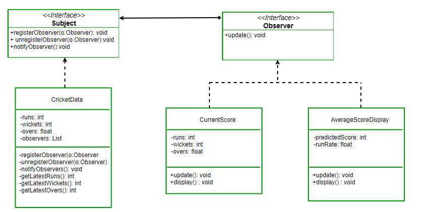

# Design-patterns
## 1. Observeurs
### Description
Premièrement, l'**observateur** est un modèle de conception comportemental et permet donc d'organiser les objets pour qu'ils puissent collaboré.  
Mais plus spécifiquement, un **observateur** est un objet qui sert notifier les objets sur un évènement qui est arrivé sur l'objet qu'ils observent.

Pour illustrer cela, nous pouvons prendre l'exemple d'un cinéma et de plusieurs clients.
Le problème est que les clients se rendent tous les jours au cinéma pour savoir si le film qu'ils veulent voir est disponible.
Ce qui est une perte de temps considérable.
La solution serait que le cinéma propose un abonemment à une newsletter (et la possibilité de se désabonner) et qu'il envoie un mail à tous les abonnés lorsque un film vient de sortir.

Mais il ne faut oublier qu'un modèle de conception peut-être réutilisé dans de nombreux cas du quotidien comme une application sportif qui envoie une notification sur le score du match lorsque ce-dernier change, ou 

### Implémentation

Implémenter une classe Match qui notifie les abonnés lorsque le score du match change.
Cette classe accepte de nouveau abonné et ils leurs permet de se désabonnér.

## 2. Fabrique abstraite
### Description
La **fabrique abstraite** est un modèle de conception qui s'inscrit dans la famille
des modèles de conceptions de construction.
Ces modèles déterminent de quelle manière on fait l'instanciation et la configuration
des classes et des objets.  
La **fabrique abstraite** permet de créer des familles d'éléments complètes sans avoir à préciser leurs classes concrètes. C'est une interface. 
La **fabrique abstraite** est donc un moyen d'implémenter chaque variante d'un élément à l'aide de classes.  
On l'utilise avec le mot clé "implements", et en java, on doit @Override les méthodes présentent dans la fabrique abstraite.

