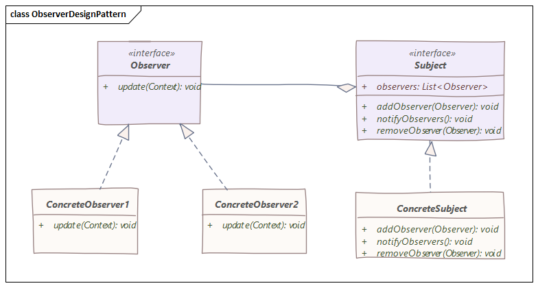

# Design-patterns
## 1. Observateur  
### Description
Premièrement, l'**observateur** est un modèle de conception comportemental et permet donc d'organiser les objets pour qu'ils puissent collaboré.  
Mais plus spécifiquement, un **observateur** est un objet qui sert à notifier les objets sur un évènement qui est arrivé sur l'objet qu'il observe.



### Exemple

Pour illustrer cela, nous pouvons prendre l'exemple d'un cinéma et de plusieurs clients.
Le problème est que les clients se rendent tous les jours au cinéma pour savoir si le film qu'ils veulent voir est disponible.
Ce qui est une perte de temps considérable.
La solution serait que le cinéma propose un abonemment à une newsletter (et la possibilité de se désabonner) et qu'il envoie un mail à tous les abonnés lorsqu'un film vient de sortir.

Mais il ne faut oublier qu'un modèle de conception peut-être réutilisé dans de nombreux cas du quotidien comme une application sportive qui envoie une notification sur le score du match lorsque ce-dernier change, ...

### Implémentation

Implémenter une classe Match qui notifie les abonnés lorsque le score du match change.
Cette classe accepte de nouveau abonné et ils leurs permet de se désabonner.


```java
public class Main {
    public static void main(String[] args) {
        Match m1 = new Match("France","Italie");

        TabScoreMax t1 = new TabScoreMax();
        TabScoreMin t2 = new TabScoreMin();

        m1.addObservale(t1);
        m1.addObservale(t2);

        System.out.println("Début du match");
        m1.setScoreDomicile();
        m1.setScoreDomicile();
        m1.setScoreDomicile();
    }
}
```
```java
import java.util.ArrayList;
import java.util.Arrays;

public class Match implements Observable{
    private String equipeDomicile;
    private String equipeVisiteur;
    private int scoreDomicile = 0;
    private int scoreVisteur = 0;

    private ArrayList<Observer> observers = new ArrayList<Observer>();
    public Match(String equipeDomicile, String equipeVisiteur) {
        super();
        this.equipeDomicile = equipeDomicile;
        this.equipeVisiteur = equipeVisiteur;
    }
    @Override
    public void addObservale(Observer obj) {
        observers.add(obj);
    }
    @Override
    public void removeObserver(Observer obj) {
        observers.remove(obj);
    }
    @Override
    public void notifyObserver() {
        for (Observer obj : observers) {
            obj.update(this);
        }
    }
    public void setScoreDomicile() {
        ++this.scoreDomicile;
        notifyObserver();
    }
    public void setScoreVisteur() {
        ++this.scoreVisteur;
        notifyObserver();
    }
    public String getEquipeDomicile() {
        return equipeDomicile;
    }
    public String getEquipeVisiteur() {
        return equipeVisiteur;
    }
    public int getScoreDomicile() {
        return scoreDomicile;
    }
    public int getScoreVisteur() {
        return scoreVisteur;
    }
}
```
```java
public interface Observable {
    public void addObservale(Observer obj);
    public void removeObserver(Observer obj);
    public void notifyObserver();
}
```
```java
public interface Observer {
    public void update (Match obj);
}
```
```java
public class TabScoreMax implements Observer{
    public TabScoreMax() {
    }
    @Override
    public void update(Match obj) {
        System.out.println(obj.getEquipeDomicile() + " " +obj.getScoreDomicile() + "  :  " + obj.getScoreVisteur() + " " +obj.getEquipeVisiteur());
    }
}
```
```java
public class TabScoreMin implements Observer{
    public TabScoreMin() {
    }

    @Override
    public void update(Match obj) {
        System.out.println(obj.getEquipeDomicile().substring(0,3) + " " +obj.getScoreDomicile() + "  :  " + obj.getScoreVisteur() + " " +obj.getEquipeVisiteur().substring(0,3));
    }
}
```


## 2. Fabrique abstraite
### Description
Le design pattern de la fabrique abstraite est un type de design pattern créationnel qui permet de créer des objets sans spécifier explicitement les classes concrètes des objets à créer. Il est utile lorsque nous avons plusieurs classes qui ont des relations de parenté et que nous voulons centraliser la logique de création de ces classes dans un seul endroit. Il permet également de rendre le code plus flexible.</br>

 Il est également utile pour respecter le principe de substitution de Liskov, qui dit qu'une classe doit être remplaçable par ses sous-classes sans que le comportement global du programme ne change.</br>

 

### Implémentation
Pour utiliser ce design pattern, nous devons d'abord créer une interface ou une classe abstraite qui définit les méthodes pour créer les objets. Cette interface ou classe est appelée "fabrique abstraite". Ensuite, nous devons créer une ou plusieurs classes concrètes qui implémentent cette interface ou qui étendent cette classe abstraite. Ces classes sont appelées "fabriques concrètes".

 

```java
package org.example.vehicles;

public class Car {
    private String model;
    private int horsePower;

    public String getModel() {
        return model;
    }

    public void setModel(String model) {
        this.model = model;
    }

    public int getHorsePower() {
        return horsePower;
    }

    public void setHorsePower(int horsePower) {
        this.horsePower = horsePower;
    }

    public Car(String model, int horsePower) {
        this.model = model;
        this.horsePower = horsePower;
    }
}
```
```java
package org.example.vehicles;

public class Motorcycle {
    private String model;
    private int horsePower;

    public String getModel() {
        return model;
    }

    public void setModel(String model) {
        this.model = model;
    }

    public int getHorsePower() {
        return horsePower;
    }

    public void setHorsePower(int horsePower) {
        this.horsePower = horsePower;
    }

    public Motorcycle(String model, int horsePower) {
        this.model = model;
        this.horsePower = horsePower;
    }
}
```
```java
package org.example.factory;

import org.example.vehicles.Car;
import org.example.vehicles.Motorcycle;

public class RenaultVehicleFactory implements VehicleFactory {
    @Override
    public Car createCar() {
        return new Car("renault car",10);
    }

    @Override
    public Motorcycle createMotorcycle() {
        return new Motorcycle("renault motorcycle",5);
    }
}
```
```java
package org.example.factory;

import org.example.vehicles.Car;
import org.example.vehicles.Motorcycle;

public class ToyotaVehicleFactory implements VehicleFactory{
    @Override
    public Car createCar() {
        return new Car("toyota car",10);
    }

    @Override
    public Motorcycle createMotorcycle() {
        return new Motorcycle("toyota motorcycle",5);
    }
}
```
```java
package org.example.factory;

import org.example.vehicles.Car;
import org.example.vehicles.Motorcycle;

public interface VehicleFactory {
    public Car createCar();
    public Motorcycle createMotorcycle();
}
```


### Sources : <br>
<br><br>
https://refactoring.guru/fr/design-patterns/observer <br>
https://refactoring.guru/fr/design-patterns/abstract-factory <br>
https://openai.com/
